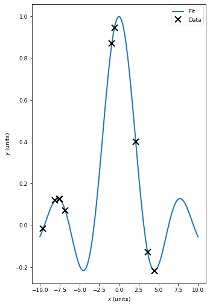
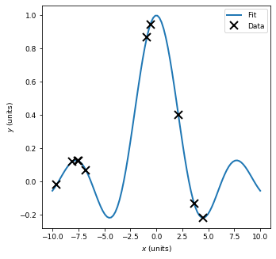
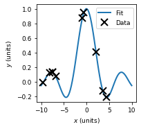

This is a quick guide for making figures that are publication-ready using matplotlib.

**Note:** PSL students must folow these directions to the letter.


```python
import numpy as np
import matplotlib.pyplot as plt
import seaborn
%matplotlib inline
```


```python
# Generate some data to plot
x = np.linspace(-10, 10, 100)
y = np.sin(x) / (x + 1e-6)
X = -10.0 + 20.0 * np.random.rand(10)
Y = np.sin(X) / X
```

## SIAM JOURNALS

The specifications for SIAM journals are:

+ Minimum figure font size: 7 pt
+ Maximum figure width: 31 picas (or 5.16663 inches)
+ Maximum figure height: 51.1 picas (or 8.5166 inches)


```python
# Set fontsize:
plt.rcParams.update({'font.size': 9}) # Pick between 7 and 10
```


```python
# The biggest figure you can have:
fig, ax = plt.subplots(figsize=(5.1667, 8.5167))
ax.plot(x, y, lw=2, label='Fit')
ax.plot(X, Y, 'kx', markersize=10, markeredgewidth=2, label='Data')
ax.set_xlabel('$x$ (units)')
ax.set_ylabel('$y$ (units)')
plt.legend(loc='best')
# THIS IS HOW YOU SHOULD SAVE - YES IN PDF FORMAT
plt.savefig("largest.pdf", dpi=300)
```





```python
# A square large figure:
fig, ax = plt.subplots(figsize=(5.1667, 5.1667))
ax.plot(x, y, lw=2, label='Fit')
ax.plot(X, Y, 'kx', markersize=10, markeredgewidth=2, label='Data')
ax.set_xlabel('$x$ (units)')
ax.set_ylabel('$y$ (units)')
plt.legend(loc='best')
# THIS IS HOW YOU SHOULD SAVE - YES IN PDF FORMAT
plt.savefig("square_largest.pdf", dpi=300)
```





```python
# A Half page figure
fig, ax = plt.subplots(figsize=(5.1667 / 2.0, 5.1667 / 2.0))
ax.plot(x, y, lw=2, label='Fit')
ax.plot(X, Y, 'kx', markersize=10, markeredgewidth=2, label='Data')
ax.set_xlabel('$x$ (units)')
ax.set_ylabel('$y$ (units)')
plt.legend(loc='best')
# THIS IS HOW YOU SHOULD SAVE - YES IN PDF FORMAT
plt.savefig("square_half.pdf", dpi=300)
```




